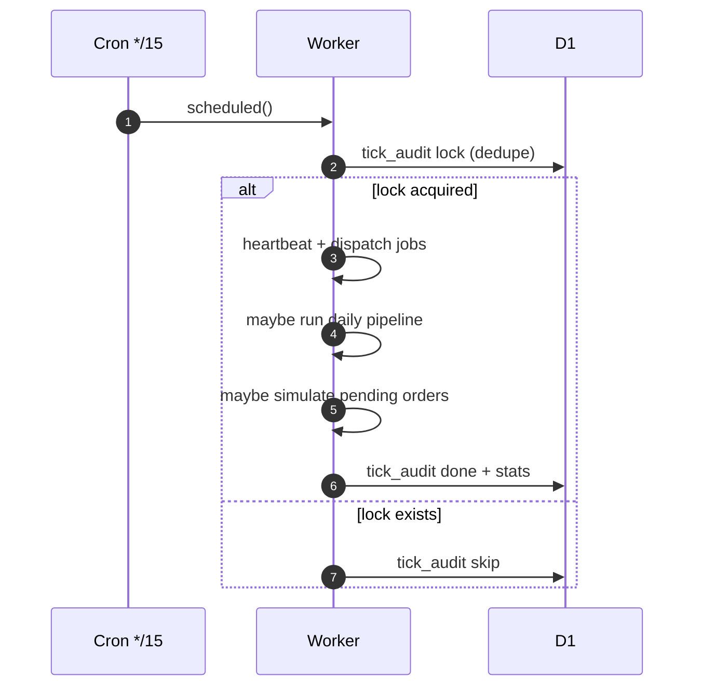
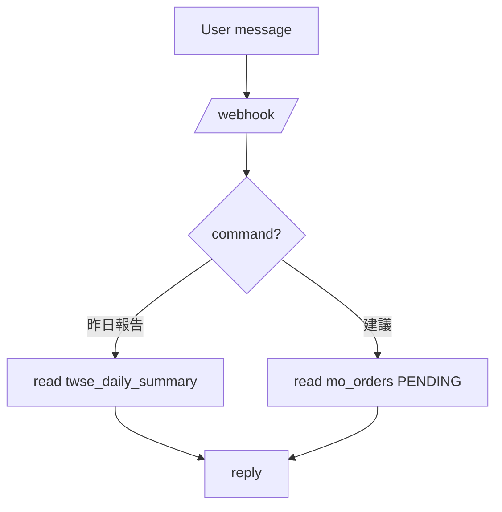

## 0.14.4 daily cycle dispatch
- Tick 不再只視 report 為盤後一次性任務；現在會在 cycle window 內重試直到隔日開盤前。
- Worker 先更新 `mo_cycle_state`，再依 `summary_ready / recommendation_ready / simulation_seeded / actionable` 判斷是否進入 report_ready / core_ready / actionable_ready。
- report push 與 recommendation/simulation bootstrap 已拆開，避免 20 交易日模擬被 report 缺席卡死。

# System Flows

## A) tick（每 15 分鐘）



## B) daily pipeline（盤後摘要 + 建議/單）

```mermaid
flowchart TD
  A[determine trade_date] --> B[fetch TWSE trade date/index]
  B --> C{TWSE snapshot ready?}
  C -- yes --> D[build & upsert twse_daily_summary]
  C -- no --> D2[skip summary (safe)]
  D --> E[generate recommendations]
  D2 --> E
  E --> F{recs empty?}
  F -- yes --> G[fallback seed (ETF)]
  F -- no --> H[use recs]
  G --> I[upsert mo_orders (signal_date)]
  H --> I
```

## C) LINE webhook（查詢/回覆）



