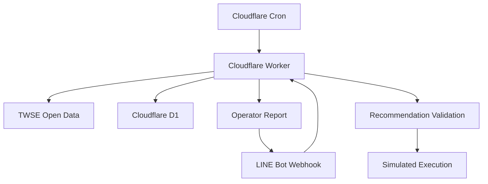

# Market Observer (MO)

Market Observer is an open-source post-market observation system for Taiwan market data. It runs on Cloudflare Workers and D1, reads TWSE open data, and sends operator-facing reports through LINE.

MO is designed for market observation, research, recommendation validation, and simulated execution review. It does **not** connect to brokers, place real orders, or manage real funds.

## Why It Exists

Taiwan retail investors and builders often need a lightweight way to inspect post-market data, generate repeatable reports, and validate recommendation logic without building a full trading platform. MO focuses on that middle layer:

- collect and normalize TWSE post-market data
- generate LINE-accessible market status and reports
- create recommendation candidates from a configurable universe
- simulate fills with daily OHLC data
- review recommendation outcomes across D0, D5, D10, and D20 checkpoints
- keep AI-assisted maintenance auditable through explicit scripts and docs

## Architecture



## Core Components

- `src/index.ts` - Cloudflare Worker runtime, LINE webhook, admin endpoints, cycle orchestration
- `migrations/` - D1 schema migrations for market summaries, recommendations, orders, positions, and review snapshots
- `scripts/mo.mjs` - CLI entrypoint for maintenance workflows
- `scripts/recommendation-review.mjs` - checkpoint review for latest recommendation batch
- `scripts/recommendation-scoreboard.mjs` - aggregate review and readiness diagnostics
- `docs/` - project memory, architecture, commands, release flow, and validation notes

## Quick Start

```bash
npm install
npm run mo -- doctor
npm run mo -- preflight
```

Useful commands:

```bash
npm run mo -- doctor
npm run mo -- guard
npm run mo -- sanity
npm run mo -- recommendation-review
npm run mo -- recommendation-scoreboard
npm run mo -- pack
```

Cloudflare deployment requires a configured Wrangler account, D1 database, and environment variables. See `docs/setup.md`, `docs/commands.md`, and `MO_START.md`.

## LINE Commands

Common operator commands include:

- `狀態` / `mo status`
- `報告` / `最新報告` / `report`
- `建議` / `推薦`
- `universe` / `標的池`
- `debug` / `除錯`

## Project Status

Current version: `0.19.30`

MO is active as an operator and validation system. The current public cleanup focuses on making the project easier for outside contributors and reviewers to understand:

- clearer README and project positioning
- explicit non-trading safety boundary
- contribution and issue templates
- release and validation workflow documentation

## Safety Boundary

MO is not financial advice and is not a trading bot. The project should be used for research, observation, and simulated validation only. Any real investment decision remains the user's responsibility.

## Contributing

Contributions are welcome, especially around documentation, data validation, Cloudflare Worker reliability, D1 migrations, tests, and safer recommendation-review tooling.

Start with:

- `CONTRIBUTING.md`
- `MO_START.md`
- `docs/AI_WORKFLOW.md`
- `docs/commands.md`

## License

MIT License. See `LICENSE`.
